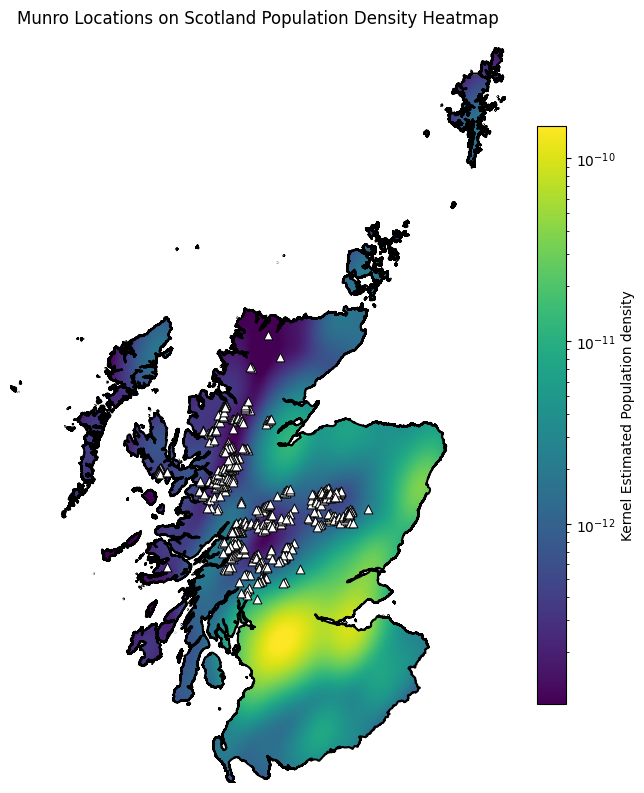

# Scottish Munros
TidyTuesday 8/19/2025

Author: Peyton Walters

This TidyTuesday I tackle a Scottish Munro dataset curated by Nicola Rennie. The Database of British and Irish Hills is licensed under a Creative Commons Attribution 4.0 International Licence. Please reference The Database of British and Irish Hills v18.2 and link to www.hills-database.co.uk.

One of the prompts for this dataset was "Which Munro is the most remote?" which I decided to analyse from a human population perspective:

Scotland Population Density Heatmap